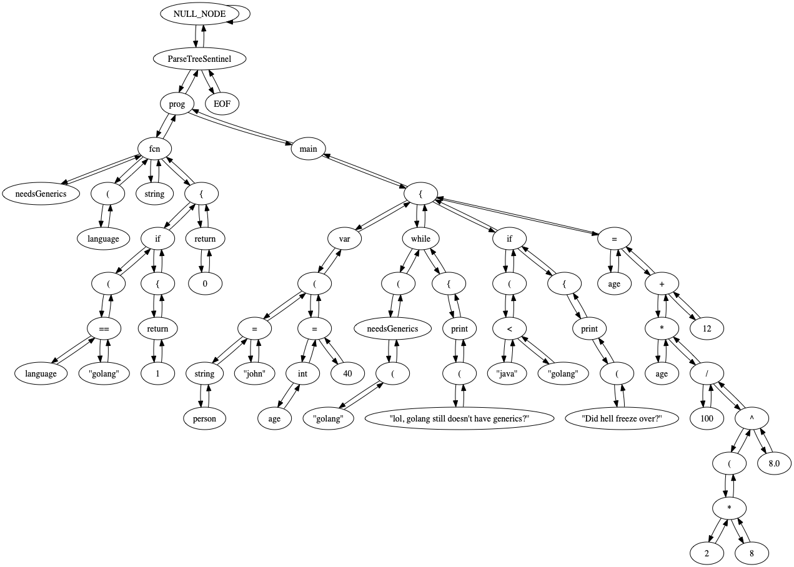

# A7 Programming Language Parser

### Team
Gregory A. Sandoval

## Introduction 
The objective of this assignment is to write a parser for the A7 language.
The parser transforms an A7 source file into a parse tree, then an abstract syntax
tree. The application then serializes the trees into images. The application
accepts source code, or a token stream (in serialized alex format). 

## The Parser
The parser is a LL(1) non-recursive predictive parser. The parser is hand
built, I've written every grammar rule and transition within the deterministic push
down automata by hand. This is not a compiler compiler (I wish!). I represent 
every grammar symbol and token with a class. These classes are nodes
within the PST or AST. Using classes was an important architectural decision, as
it allowed me to use the visitor pattern to build out better compiler phases.
This may not be entirely clear now, but later compiler phases would benefit greatly
from this decision.

## A7 Grammar
Below is the uneditied context free grammar for the A7 programming language. In order
to be processed by the parser I had to remove all the left recursion and the left common
prefixes. 
```
Pgm = kwdprog Vargroup Fcndefs Main 
Main = kwdmain BBlock
BBlock = brace1 Vargroup Stmts brace2
Vargroup = kwdvars PPvarlist | eps 
PPvarlist = parens1 Varlist parens2 
Varlist = Varitem semi Varlist | eps 
Varitem = Vardecl | Vardecl equal Varinit 
Varitem = Classdecl | Classdef 
Vardecl = Simplekind Varspec 
Simplekind = Basekind | Classid 
Basekind = kint | kfloat | kstring
Classid = id
Varspec = Varid | Arrspec | Deref_id 
Varid = id
Arrspec = Varid KKint
KKint = bracket1 int bracket2 
Deref_id = Deref id
Deref = aster
Varinit = Expr | BBexprs
BBexprs = brace1 Exprlist brace2 | brace1 brace2 
Exprlist = Expr Moreexprs
Moreexprs = comma Exprlist | eps
Classdecl = kwdclass Classid
Classdef = Classheader BBclassitems
Classdef = Classheader kif BBclassitems 
BBClassitems = brace1 Classitems brace2 Classheader = Classdecl Classmom Interfaces 
Classmom = colon Classid | eps
Classitems = Classgroup Classitems | eps
Classgroup = Class_ctrl | Vargroup | Mddecls 
Class_ctrl = colon id // in {public, protected, private} 
Interfaces = plus Classid Interfaces | eps
Mddecls = Mdheader Mddecls | eps 
Mdheader = kwdfcn Md_id PParmlist Retkind 
Md_id = Classid colon Fcnid
Fcndefs = Fcndef Fcndefs | eps 
Fcndef = Fcnheader BBlock
Fcnheader = kwdfcn Fcnid PParmlist Retkind 
Fcnid = id
Retkind = Basekind
PParmlist = parens1 Varspecs parens2 | PPonly 
Varspecs = Varspec More_varspecs 
More_varspecs = comma Varspecs | eps 
PPonly = parens1 parens2
Stmts = Stmt semi Stmts | eps 
Stmt = Stasgn | Fcall | Stif 
Stmt = Stwhile | Stprint | Strtn
Stasgn = Lval equal Expr
Lval = Varid | Aref | Deref_id 
Aref = Varid KKexpr
KKexpr = bracket1 Expr bracket2
Fcall = Fcnid PPexprs
PPexprs = parens1 Exprlist parens2 | PPonly
Stif = kwdif PPexpr BBlock Elsepart 
Elsepart = kwdelseif PPexpr BBlock Elsepart 
Elsepart = kwdelse BBlock | eps
Stwhile = kwdwhile PPexpr BBlock 
Stprint = kprint PPexprs
Strtn = kwdreturn Expr | kwdreturn
PPexpr = parens1 Expr parens2
Expr = Expr Oprel Rterm | Rterm
Rterm = Rterm Opadd Term | Term
Term = Term Opmul Fact | Fact
Fact = BaseLiteral | Lval | Addrof_id | Fcall | Ppexpr 
BaseLiteral = int | float | string
Addrof_id = ampersand id
Oprel = opeq | opne | Lthan | ople | opge | Gthan 
Lthan = angle1
Gthan = angle2
Opadd = plus | minus
Opmul = aster | slash | caret
```

I modified the grammar to be LL(1) parsable, the below grammar includes the full first 
and follow sets, along with any extra rules after processing. In general a `_Suffix` rule
is the result from Left Factoring, and `_Tail` is the result form Left recursion elimination.
Any rule with a prefix of `!` is a result of marking rules that can transition directly to 
epsilon.

```
First(Pgm)                  = {kwdprog}
Follow(Pgm)                 = {EOF}
Pgm                         = kwdprog       !Vargroup        !Fcndefs         Main

First(Main)                 = {kwdmain}
Follow(Main)                = {EOF}
Main                        = kwdmain       BBlock

First(BBlock)               = {brace1}
Follow(BBlock)              = {EOF} U {kwdfcn, kwdmain} U ({kwdelseif, kwdelse}) U {semi} U {semi} U {semi}
BBlock                      = brace1        !Vargroup        !Stmts           brace2


First(!Vargroup)            = {kwdvars}
Follow(!Vargroup)           = {kwdfcn, kwdmain, aster, id, kwdif, kwdwhile, kprint, kwdreturn, brace2, colon, kwdvars}
!Vargroup                   = kwdvars       PPvarlist
!Vargroup                   = !eps

First(PPvarlist)            = {parens1}
Follow(PPvarlist)           = {kwdfcn, kwdmain, aster, id, kwdif, kwdwhile, kprint, kwdreturn, brace2, colon, kwdvars}
PPvarlist                   = parens1       !Varlist         parens2

First(!Varlist)             = {kint, kfloat, kstring, id, kwdclass}
Follow(!Varlist)            = {parens2}
!Varlist                    = Varitem       semi            !Varlist
!Varlist                    = !eps

First(Varitem)              = {kint, kfloat, kstring, id} U {kwdclass}
Follow(Varitem)             = {semi}
Varitem                     = Vardecl       !Varitem_Suffix
Varitem                     = Classdef

First(!Varitem_Suffix)      = {equal}
Follow(!Varitem_Suffix)     = {semi}
!Varitem_Suffix             = equal           Varinit
!Varitem_Suffix             = !eps

First(Vardecl)              = {kint, kfloat, kstring, id}
Follow(Vardecl)             = {equal, semi}
Vardecl                     = Simplekind    Varspec

First(Simplekind)           = {kint, kfloat, kstring} U {id}
Follow(Simplekind)          = {aster, id}
Simplekind                  = Basekind
Simplekind                  = Classid

First(Basekind)             = {kint, kfloat, kstring}
Follow(Basekind)            = {aster, id} U {brace1, kwdfcn, colon, kwdvars, brace2}
Basekind                    = kint
Basekind                    = kfloat
Basekind                    = kstring

First(Classid)              = {id}
Follow(Classid)             = {aster, id, colon, plus} U {brace1, kif} U {plus, brace1, kif} U {brace1, kif} U {colon}
Classid                     = id

First(Varspec)              = {aster} U {id}
Follow(Varspec)             = {equal, semi, comma, parens2}
Varspec                     = Varid         !Arrspec
Varspec                     = Deref_id

First(Varid)                = {id}
Follow(Varid)               = {bracket1, equal, semi, comma, parens2}
Varid                       = id

First(!Arrspec)             = {bracket1}
Follow(!Arrspec)            = {equal, semi, comma, parens2}
!Arrspec                    = KKint
!Arrspec                    = !eps

First(KKint)                = {bracket1}
Follow(KKint)               = {equal, semi, comma, parens2}
KKint                       = bracket1      int             bracket2

First(Deref_id)             = {aster}
Follow(Deref_id)            = {equal, semi, comma, parens2} U {aster, slash, caret, plus, minus, opeq, opne, angle1, ople, opge, angle2, brace2, bracket2, semi, parens2, comma}
Deref_id                    = Deref         id

First(Deref)                = {aster}
Follow(Deref)               = {id}
Deref                       = aster


First(Varinit)              = {int, float, string, aster, id, ampersand, parens1} U {brace1}
Follow(Varinit)             = {semi}
Varinit                     = Expr
Varinit                     = BBexprs

First(BBexprs)              = {brace1}
Follow(BBexprs)             = {semi}
BBexprs                     = brace1        !Exprlist        brace2

First(!Exprlist)            = {int, float, string, aster, id, ampersand, parens1}
Follow(!Exprlist)           = {brace2, parens2}
!Exprlist                   = Expr          !Moreexprs
!Exprlist                   = !eps

First(!Moreexprs)           = {comma}
Follow(!Moreexprs)          = {brace2, parens2}
!Moreexprs                  = comma         Expr            !Moreexprs
!Moreexprs                  = !eps


First(Classdef)             = {kwdclass}
Follow(Classdef)            = {semi}
Classdef                    = Classheader   Classdef_Suffix

First(Classdef_Suffix)      = {brace1} U {kif}
Follow(Classdef_Suffix)     = {semi}
Classdef_Suffix             = BBClassitems
Classdef_Suffix             = kif             BBClassitems

First(BBClassitems)         = {brace1}
Follow(BBClassitems)        = {semi}
BBClassitems                = brace1        !Classitems      brace2

First(Classheader)          = {kwdclass}
Follow(Classheader)         = {brace1, kif}
Classheader                 = kwdclass      Classid     !Classmom        !Interfaces

First(!Classmom)            = {colon}
Follow(!Classmom)           = {plus, brace1, kif}
!Classmom                   = colon         !Classid
!Classmom                   = !eps

First(!Classitems)          = {colon, kwdvars, kwdfcn}
Follow(!Classitems)         = {brace2}
!Classitems                 = !Classgroup    !Classitems
!Classitems                 = !eps

First(!Classgroup)          = {colon} U {kwdvars} U {kwdfcn}
Follow(!Classgroup)         = {colon, kwdvars, kwdfcn, brace2}
!Classgroup                 = Class_ctrl
!Classgroup                 = !Vargroup
!Classgroup                 = !Mddecls

First(Class_ctrl)           = {colon}
Follow(Class_ctrl)          = {colon, kwdvars, kwdfcn, brace2}
Class_ctrl                  = colon         id

First(!Interfaces)          = {plus}
Follow(!Interfaces)         = {brace1, kif}
!Interfaces                 = plus          Classid         !Interfaces
!Interfaces                 = !eps


// Mistake :(
First(!Mddecls)             = {kwdfcn}
Follow(!Mddecls)            = {colon, kwdvars, kwdfcn, brace2}
!Mddecls                    = Mdheader      !Mddecls
!Mddecls                    = !eps

First(Mdheader)             = {kwdfcn}
Follow(Mdheader)            = {kwdfcn, colon, kwdvars, brace2}
Mdheader                    = kwdfcn        Md_id           PParmlist       Retkind

First(Md_id)                = {id}
Follow(Md_id)               = {parens1}
Md_id                       = Classid       colon           Fcnid


First(!Fcndefs)             = {kwdfcn}
Follow(!Fcndefs)            = {kwdmain}
!Fcndefs                    = Fcndef        !Fcndefs
!Fcndefs                    = !eps

First(Fcndef)               = {kwdfcn}
Follow(Fcndef)              = {kwdfcn, kwdmain}
Fcndef                      = Fcnheader     BBlock

First(Fcnheader)            = {kwdfcn}
Follow(Fcnheader)           = {brace1}
Fcnheader                   = kwdfcn        Fcnid           PParmlist       Retkind

First(Fcnid)                = {id}
Follow(Fcnid)               = {parens1}
Fcnid                       = id

First(Retkind)              = {kint, kfloat, kstring}
Follow(Retkind)             = {brace1, kwdfcn, colon, kwdvars, brace2}
Retkind                     = Basekind

First(PParmlist)            = {parens1}
Follow(PParmlist)           = {kint, kfloat, kstring}
PParmlist                   = parens1       !Varspecs        parens2

First(!Varspecs)            = {aster, id}
Follow(!Varspecs)           = {parens2}
!Varspecs                   = Varspec       !More_varspecs
!Varspecs                   = !eps

First(!More_varspecs)       = {comma}
Follow(!More_varspecs)      = {parens2}
!More_varspecs              = comma         Varspec         !More_varspecs
!More_varspecs              = !eps


First(!Stmts)               = {aster, id, kwdif, kwdwhile, kprint, kwdreturn}
Follow(!Stmts)              = {brace2}
!Stmts                      = Stmt            semi            !Stmts
!Stmts                      = !eps

First(Stmt)                 = {aster, id} U {kwdif} U {kwdwhile} U {kprint} U {kwdreturn}
Follow(Stmt)                = {semi}
Stmt                        = StasgnOrFcall
Stmt                        = Stif
Stmt                        = Stwhile
Stmt                        = Stprint
Stmt                        = Strtn

First(StasgnOrFcall)        = {aster} U {id}
Follow(StasgnOrFcall)       = {semi}
StasgnOrFcall               = Deref_id        Stasgn_Suffix                     // It's  Stasgn
StasgnOrFcall               = id              StasgnOrFcall_Suffix              // It's  Either one

First(StasgnOrFcall_Suffix) = {bracket1, equal} U {parens1}
Follow(StasgnOrFcall_Suffix)= {semi}
StasgnOrFcall_Suffix        = !Lval_Suffix    Stasgn_Suffix                     // It's  Stasgn
StasgnOrFcall_Suffix        = PPexprs                                           // It's  Fcall

First(Stasgn_Suffix)        = {equal}
Follow(Stasgn_Suffix)       = {semi}
Stasgn_Suffix               = equal           Expr

First(!Lval_Suffix)         = {bracket1}
Follow(!Lval_Suffix)        = {equal, aster, slash, caret, plus, minus, opeq, opne, angle1, ople, opge, angle2, brace2, bracket2, semi, parens2, comma}
!Lval_Suffix                = KKexpr
!Lval_Suffix                = !eps

First(KKexpr)               = {bracket1}
Follow(KKexpr)              = Follow(!Lval_Suffix)
KKexpr                      = bracket1        Expr            bracket2


First(PPexprs)              = {parens1}
Follow(PPexprs)             = {aster, slash, caret, plus, minus, opeq, opne, angle1, ople, opge, angle2, brace2, bracket2, semi, parens2, comma} U Follow(Fcall)
PPexprs                     = parens1         !Exprlist        parens2


First(Stif)                 = {kwdif}
Follow(Stif)                = {semi}
Stif                        = kwdif           PPexpr          BBlock          !Elsepart

First(!Elsepart)            = {kwdelseif, kwdelse}
Follow(!Elsepart)           = {semi}
!Elsepart                   = kwdelseif       PPexpr          BBlock          !Elsepart
!Elsepart                   = kwdelse         BBlock
!Elsepart                   = !eps


First(Stwhile)              = {kwdwhile}
Follow(Stwhile)             = {semi}
Stwhile                     = kwdwhile        PPexpr          BBlock

First(Stprint)              = {kprint}
Follow(Stprint)             = {semi}
Stprint                     = kprint          PPexprs


First(Strtn)                = {kwdreturn}
Follow(Strtn)               = {semi}
Strtn                       = kwdreturn       !Strtn_Suffix

First(!Strtn_Suffix)        = {int, float, string, aster, id, ampersand, parens1}
Follow(!Strtn_Suffix)       = {semi}
!Strtn_Suffix               = Expr
!Strtn_Suffix               = !eps


First(PPexpr)               = {parens1}
Follow(PPexpr)              = {brace1}
PPexpr                      = parens1         Expr            parens2

First(Expr)                 = {int, float, string, aster, id, ampersand, parens1}
Follow(Expr)                = {brace2, bracket2, semi, parens2, comma}
Expr                        = Rterm           !Expr_Tail

First(!Expr_Tail)           = {opeq, opne, angle1, ople, opge, angle2}
Follow(!Expr_Tail)          = {brace2, bracket2, semi, parens2, comma}
!Expr_Tail                  = Oprel           Rterm         !Expr_Tail
!Expr_Tail                  = !eps

First(Rterm)                = {int, float, string, aster, id, ampersand, parens1}
Follow(Rterm)               = {opeq, opne, angle1, ople, opge, angle2, brace2, bracket2, semi, parens2, comma, parens2}
Rterm                       = Term            !Rterm_Tail

First(!Rterm_Tail)          = {plus, minus}
Follow(!Rterm_Tail)         = {opeq, opne, angle1, ople, opge, angle2, brace2, bracket2, semi, parens2, comma, parens2}
!Rterm_Tail                 = Opadd           Term          !Rterm_Tail
!Rterm_Tail                 = !eps

First(Term)                 = {int, float, string, aster, id, ampersand, parens1}
Follow(Term)                = {plus, minus, opeq, opne, angle1, ople, opge, angle2, brace2, bracket2, semi, parens2, comma}
Term                        = Fact            !Term_Tail

First(!Term_Tail)           = {aster, slash, caret}
Follow(!Term_Tail)          = {plus, minus, opeq, opne, angle1, ople, opge, angle2, brace2, bracket2, semi, parens2, comma}
!Term_Tail                  = Opmul           Fact          !Term_Tail
!Term_Tail                  = !eps

First(Fact)                 = {int, float, string} U {aster, id} U {ampersand} U {parens1}
Follow(Fact)                = {aster, slash, caret, plus, minus, opeq, opne, angle1, ople, opge, angle2, brace2, bracket2, semi, parens2, comma}
Fact                        = BaseLiteral
Fact                        = LvalOrFcall
Fact                        = Addrof_id
Fact                        = PPexpr

First(LvalOrFcall)          = {aster} U {id}
Follow(LvalOrFcall)         = {aster, slash, caret, plus, minus, opeq, opne, angle1, ople, opge, angle2, brace2, bracket2, semi, parens2, comma}
LvalOrFcall                 = Deref_id                      // Is Lval
LvalOrFcall                 = id         !LvalOrFcall_Suffix // Either one

First(!LvalOrFcall_Suffix)  = {bracket1} U {parens1}
Follow(!LvalOrFcall_Suffix) = {aster, slash, caret, plus, minus, opeq, opne, angle1, ople, opge, angle2, brace2, bracket2, semi, parens2, comma}
!LvalOrFcall_Suffix         = !Lval_Suffix                  // It's an Lval
!LvalOrFcall_Suffix         = PPexprs                       // It's a Fcall

First(BaseLiteral)          = {int, float, string}
Follow(BaseLiteral)         = {aster, slash, caret, plus, minus, opeq, opne, angle1, ople, opge, angle2, brace2, bracket2, semi, parens2, comma}
BaseLiteral                 = int
BaseLiteral                 = float
BaseLiteral                 = string

First(Addrof_id)            = {ampersand}
Follow(Addrof_id)           = {aster, slash, caret, plus, minus, opeq, opne, angle1, ople, opge, angle2, brace2, bracket2, semi, parens2, comma}
Addrof_id                   = ampersand       id

First(Oprel)                = {opeq, opne, angle1, ople, opge, angle2}
Follow(Oprel)               = {int, float, string, aster, id, ampersand, parens1}
Oprel                       = opeq
Oprel                       = opne
Oprel                       = angle1
Oprel                       = ople
Oprel                       = opge
Oprel                       = angle2

First(Opadd)                = {plus, minus}
Follow(Opadd)               = {int, float, string, aster, id, ampersand, parens1}
Opadd                       = plus
Opadd                       = minus

First(Opmul)                = {aster, slash, caret}
Follow(Opmul)               = {int, float, string, aster, id, ampersand, parens1}
Opmul                       = aster
Opmul                       = slash
Opmul                       = caret
```

## Dependencies
Ant is an optional dependency, I've included a prebuilt jar file, so you
can skip that step. Java 13 is *_required_*. The A5 Lexer is also a requirement,
but i've included a prebuilt jar as well. 

```shell script
brew install java
brew install ant
```


## How to run
In the root directory, run the following commands. 


### Building it from source
The first command builds the java code. The second passes a text 
file to the lexer. The lexer outputs the results to standard out, 
in `.alex` format.

```
ant
java --enable-preview -cp ./Lexer.jar:./out/production/Parser Main --file=sample.a7 
```


### Running the prebuilt jar
I've included a sample test file, the expected result after running the
java code should be as follows.

```
java --enable-preview -jar Parser.jar --file=sample.a7
```

Contents of `sample.a7`:
``` 
prog

fcn needsGenerics(language) string {
  if(language == "golang"){
      return 1;
  };
  return 0; // 99% accuracy
}

main {
  var (
      string person = "john";
      int age = 40;
  )

  while(needsGenerics("golang")) {
      print("lol, golang still doesn't have generics?");
  };

  if("java" < "golang"){
      print("Did hell freeze over?");
  };

  age = age * 100 / (2 * 8) ^ 8.0 + 12;
}
```

Parse Tree:


Abstract Syntax Tree:


Using the jar emits the same output, but requires no build steps:

```
java -jar Parser.jar --file=sample.a7
```


## Features
- Fill in later
